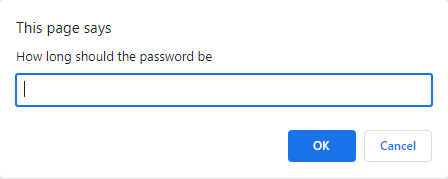
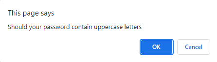
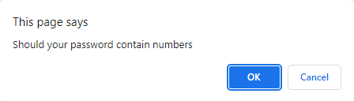
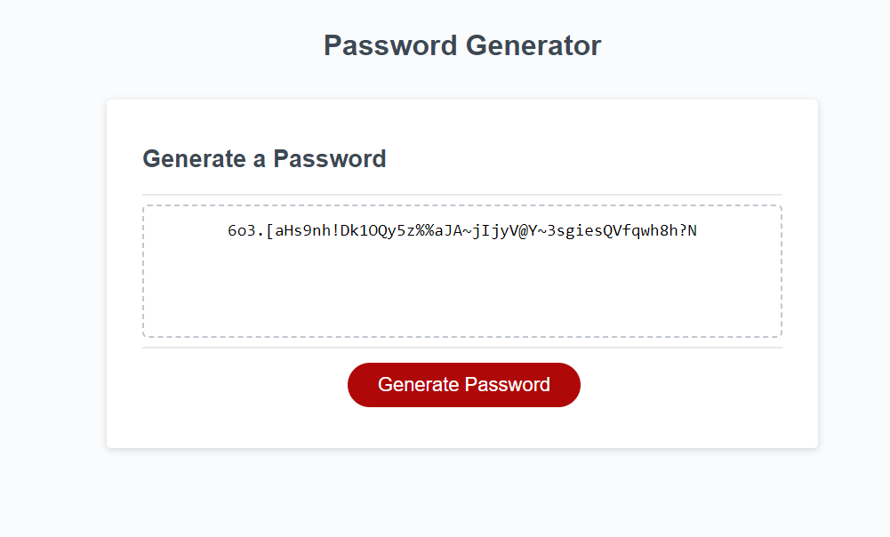

# Password Generator

## Table of Contents
* [Screenshot of page](#screenshots)
* [Information](#information)
* [Installation](#installation)
* [Credits](#credits)
* [License](#license)
* [Tests](#tests)

## Screenshots

## Information
The HTML and CSS for this page were given to me by the edX bootcamp: Skills Boot Camp in Front-End Web Development. My task was to write the JavaScript for this page in order to ask the user for the length of the password and the types of characters the password should contain. If the user enters valid inputs, a random password will be generated and displayed on the screen. There is also a button which includes the text 'Generate Password' which allows the user to input values again and generate a different password.

## Installation
Click on this link: https://programmer90000.github.io/password-generator/

## Credits
The HTML and CSS for this page was from the edX bootcamp: Skills Boot Camp in Front-End Web Development

## License
GNU GENERAL PUBLIC LICENSE (GPL) version 3.0

## Tests
Input different values into the prompts to test if the program will produce the correct output based upon the conditions provided